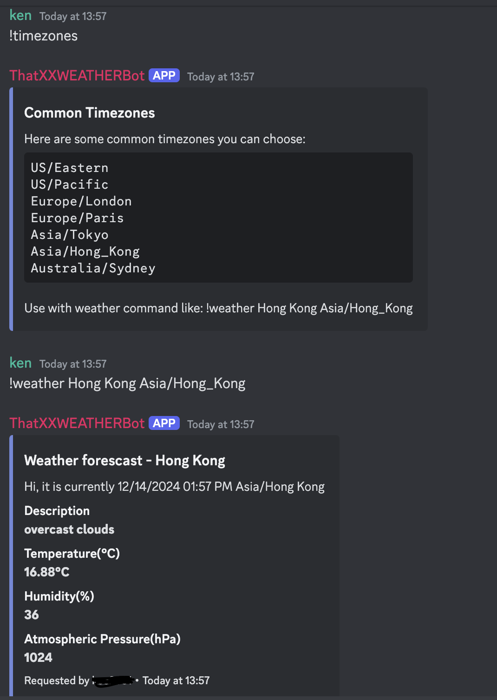

# weatherbot_discord

A discord bot shows you the weather condition of every place you wanna know.

## Project Overview

This bot works well with **Discord** and uses *Open Weather API* to fetch the weather information of a given city. 

<p>
  
</p>

## Instructions

Procedure to do so:
1. invite the bot to your *Discord Server* by creating a bot on [this url](https://discord.com/developers/docs/intro)
2. give the necessary permissions and remember to install the required packages (check out requirement.txt)
3. type the underneath command to fetch weather information:
   
```
!timezones (optional)
!weather <City Name> <timezones>
```

4. QED~
